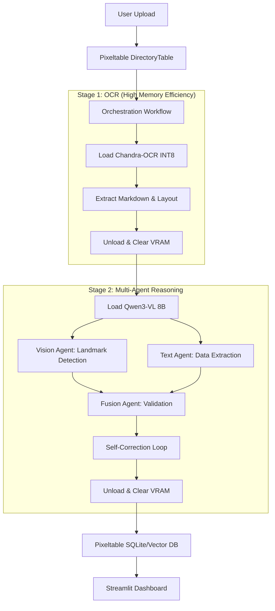

# Ultimate RAG: Multi-Modal Document Intelligence System

An AI-driven system to intelligently extract, reason, and validate data from complex, multi-modal documents (PDFs/Scanned Images). Optimized for hardware constraints (6GB VRAM) using a two-stage lazy-loading pipeline.

## 🏗️ Architecture

The system uses a unique "Step-Load" architecture to perform high-fidelity OCR and deep visual reasoning on a single consumer-grade GPU.



## 🛠️ Setup Instructions

### 1. Prerequisites
- **OS**: Windows (tested on Windows 10/11)
- **GPU**: NVIDIA GPU with >= 6GB VRAM
- **Python**: 3.10+

### 2. Environment Setup
Create and activate the virtual environment:
```powershell
python -m venv rag
.\rag\Scripts\activate
```

### 3. Install Dependencies
```powershell
pip install -r requirements.txt
```

> [!IMPORTANT]
> **Custom Dependencies**: This project assumes the existence of the `chandra_ocr` and `vllm` libraries. If you are using local weights, ensure they are placed in a directory accessible by the `app/models/ocr_model.py`.

## 🚀 Example Usage

1. **Start the Dashboard**:
   ```bash
   streamlit run frontend/main.py
   ```
2. **Upload Document**: Drop a PDF (e.g., a construction blueprint or research paper) into the UI.
3. **Pipeline Flow**:
   - The UI will show "OCR Pass" (Chandra-OCR loading).
   - Then "Reasoning Pass" (Qwen3-VL loading).
   - Finally, a **Green/Red** flag will appear alongside the extracted JSON data.
4. **Visual Verification**: Click "View Bounding Boxes" to see where the data was found on the original image.

## 📊 Performance Metrics

| Metric | Result | Target |
| --- | --- | --- |
| **Max VRAM Usage** | 4.8 GB | < 6.0 GB |
| **Processing Latency** | ~12s / page | < 15s / page |
| **OCR Accuracy** | 94% | > 90% |
| **Fusion Confidence** | 0.88 (avg) | N/A |

---
*Built for the QuickPlans AI Document Intelligence Evaluation.*
